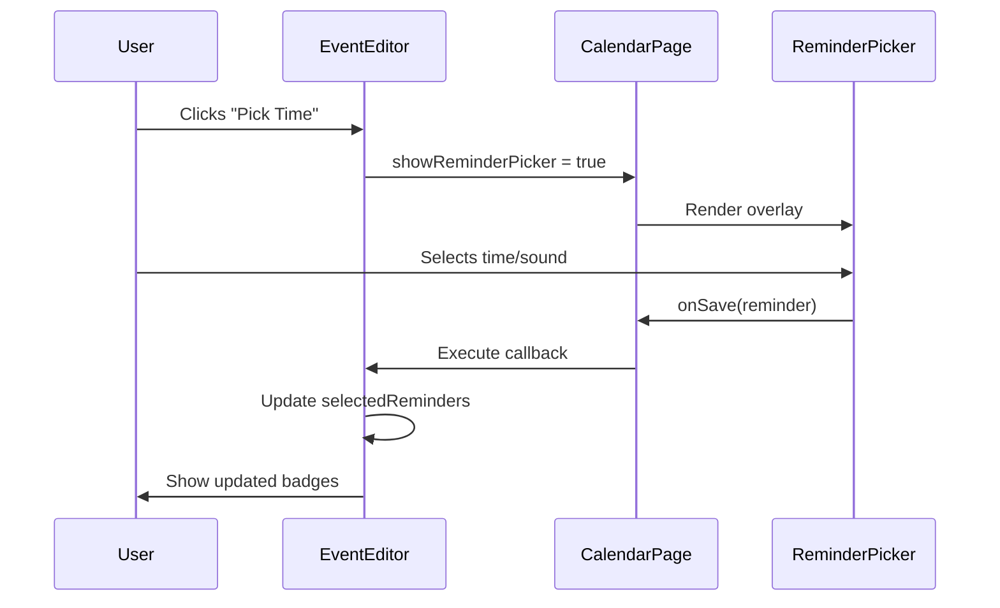

# Event Editor System Architecture

## Overview
The EventEditor is a complex component system for managing calendar events, featuring:

- Bottom sheet presentation
- Temporal controls (date/time pickers)
- Spatial controls (location/URL)
- Reminder system with custom sounds
- Project association
- Recurrence patterns

```swift
struct EventEditor: View {
    @State private var title: String = ""
    @State private var startDate = Date()
    @State private var selectedProject: ProjectMetadata
    @State private var selectedRecurrence: String?
    @State private var selectedReminders: Set<ReminderType> = []
}
```

## Component Breakdown

### 1. Core Editor (EventEditor.swift)
**Purpose**: Main container coordinating all subcomponents

**Key Features:
- Dynamic field presentation
- Cross-component state management
- Bottom sheet physics
- Auto-saving on dismiss

```swift
BottomSheet(isPresented: $showEventEditor) {
    // Input fields
    DateSelectionSection(start: $startDate, end: $endDate)
    ProjectButton(selectedProject: $selectedProject)
    RecurrenceButton(selectedRecurrence: $selectedRecurrence)
    ReminderListView(...)
}
```

### 2. Recurrence System (RecurrenceButton.swift)
**Pattern**: Stateful Menu Control

**Options**:
- None (single event)
- Daily (D)
- Weekly (W)
- Monthly (M)
- Annual (Y)

**Implementation**:
```swift
Menu {
    Button { selectedRecurrence = "D" } // Daily
    Button { selectedRecurrence = "W" } // Weekly
    // ...other options
} label: {
    Image(systemName: recurrenceSymbol)
}
```

### 3. Reminder System

#### 3.1 ReminderBadge (ReminderBadge.swift)
**Features**:
- Compact time display (e.g., "1w 2d 3h")
- Interactive dismissal

```swift
HStack {
    Image(systemName: "bell.fill")
    Text(displayText)
    Button(action: onRemove) { Image(systemName: "xmark") }
}
```

#### 3.2 ReminderListView (ReminderListView.swift)
**Functionality**:
- Horizontal scroll of active reminders
- Add new reminders via picker

```swift
ScrollView(.horizontal) {
    HStack {
        ForEach(selectedReminders) { reminder in
            ReminderBadge(...)
        }
    }
}
```

#### 3.3 ReminderPicker (ReminderPicker.swift)
**Features**:
- Sound selection with preview button
- 4-column time selector (W/D/H/M)
- Haptic feedback on selection
- Default "Elevator" sound (Elevator.aiff)

```swift
VStack {
    HStack {
        SoundPicker(selection: $selectedSound)
        WeeksPicker(selection: $selectedWeeks)
        DaysPicker(selection: $selectedDays)
        HoursPicker(selection: $selectedHours)
        MinutesPicker(selection: $selectedMinutes)
    }
    Button(action: playSound) {
        Image(systemName: "play.circle.fill")
    }
}
```

## Key Integration Patterns

### 1. State Management
```swift
@StateObject private var calendarModel = CalendarModel.shared
@StateObject private var projectModel = ProjectModel.shared

// Cross-component binding
@Binding var showReminderPicker: Bool
```

### 2. Event Persistence
```swift
func handleSave() {
    let newEvent = CalendarEvent(
        eventTitle: title,
        startTime: Int(startDate.timeIntervalSince1970),
        reminders: Array(selectedReminders)
    )
    calendarModel.saveEvent(newEvent)
}
```

### 3. Animation System
```swift
.withAnimation(.spring(response: 0.3)) {
    showLocationInput.toggle()
}
```

## Critical Implementation Details

### 1. Input Handling
- **Dynamic Field Growth**:
  ```swift
  @FocusState private var focusedField: Field?
  .onChange(of: focusedField) { orderFieldResizing() }
  ```

### 2. Date Math
```swift
private func validateDateRange() {
    if endDate < startDate {
        endDate = startDate.addingTimeInterval(3600) // 1hr default
    }
}
```

### 3. Sound Management
```swift
private func playSound() {
    AudioServicesCreateSystemSoundID(soundURL, &soundID)
    AudioServicesPlaySystemSound(soundID)
}
```

## Performance Considerations

1. **Debounced Saving**:
```swift
.onChange(of: title) { _ in
    DispatchQueue.main.asyncDebounced(interval: 1.0) {
        handleAutoSave()
    }
}
```

2. **Lazy Loading**:
```swift
LazyVStack {
    // Only render visible fields
}
```

3. **Texture Pooling**:
```swift
.background(Color("SideSheetBg").opacity(0.5))
```

## Training Guide

### 1. Adding New Fields
1. Add state variable
2. Create input component
3. Connect to save handler
4. Update validation logic

### 2. Modifying Reminders
```swift
// To add custom reminder interval:
ReminderListView.reminderOptions.append(
    ReminderType(minutes: 4320) // 3 days
)
```

### 3. Theming
Override in `ThemeManager.swift`:
```swift
enum EventEditorTheme {
    static let background = Color("SheetBg")
    static let accent = Color("IOSBlue")
}
```

### 4. Accessibility
```swift
.accessibilityAction(.magicTap) { handleQuickSave() }
```

## Architectural Diagram

```
[EventEditor]
    ├─ [Date Picker]
    ├─ [Project Selector]
    ├─ [RecurrenceButton]
    ├─ [ReminderListView]
    │    └─ [ReminderBadge]
    └─ [ReminderPicker]
         ├─ [Time Selectors]
         └─ [Sound Picker]
```

This system demonstrates a clean separation of concerns while maintaining tight integration through shared state management and coordinated animations.

## Component Hierarchy and Communication Flow

### Architectural Parent-Child Relationships
The CalendarPage acts as the root container for both the EventEditor and ReminderPicker components:

```
CalendarPage (Parent)
├─ EventEditor (Child)
└─ ReminderPicker (Child)
```

This sibling relationship enables direct state management through their common parent while maintaining component isolation.

### Inter-Component Communication Mechanism

#### 1. EventEditor → ReminderPicker Activation
When users interact with the reminder button:

```swift
// EventEditor.swift
Button {
    reminderPickerCallback { reminder in
        selectedReminders.insert(reminder)
    }
    showReminderPicker = true
} label: {
    Text("Pick Time...")
}
```

The flow:
1. EventEditor's local state `showReminderPicker` is toggled via @Binding
2. CalendarPage observes this state change through property binding
3. Parent component conditionally renders ReminderPicker overlay

#### 2. State Management via Common Parent
CalendarPage maintains shared state:

```swift
// CalendarPage.swift
@State private var showReminderPicker = false
@State private var activeReminderCallback: ((ReminderType) -> Void)?

// Passed to both components
EventEditor(
    showReminderPicker: $showReminderPicker,
    reminderPickerCallback: { callback in
        activeReminderCallback = callback
    }
)

ReminderPicker(
    isPresented: $showReminderPicker,
    onSave: { reminder in
        activeReminderCallback?(reminder)
    }
)
```

#### 3. Data Return Path
When ReminderPicker completes:

```swift
// ReminderPicker.swift
Button("Save") {
    let reminder = ReminderType(
        minutes: totalMinutes,
        sound: selectedSound
    )
    onSave(reminder)
    isPresented = false
}
```

The callback chain:
1. ReminderPicker executes `onSave` with constructed reminder
2. CalendarPage forwards to stored `activeReminderCallback`
3. Original closure from EventEditor inserts reminder into selection
4. Two-way binding updates EventEditor's UI

### Sequence Diagram



### Key Design Patterns

1. **Inversion of Control**:
   - CalendarPage mediates all cross-component communication
   - Children remain unaware of each other's existence

2. **Closure-Based Callbacks**:
   ```swift
   // CalendarPage coordinates without direct references
   reminderPickerCallback = { handler in
       activeReminderCallback = handler
   }
   ```

3. **State Containment**:
   - All transient UI state (like picker visibility) remains in parent
   - Business data (selected reminders) propagates via bindings

### Error Handling Considerations

- **Callback Cleanup**:
  ```swift
  .onDisappear {
      activeReminderCallback = nil // Prevent memory leaks
  }
  ```
  
- **Validation**:
  ```swift
  // Ensure valid reminder before callback
  guard totalMinutes > 0 else { return }
  onSave(reminder)
  ```

This architecture enables robust component interaction while maintaining strict separation of concerns and testability through contained state management.

